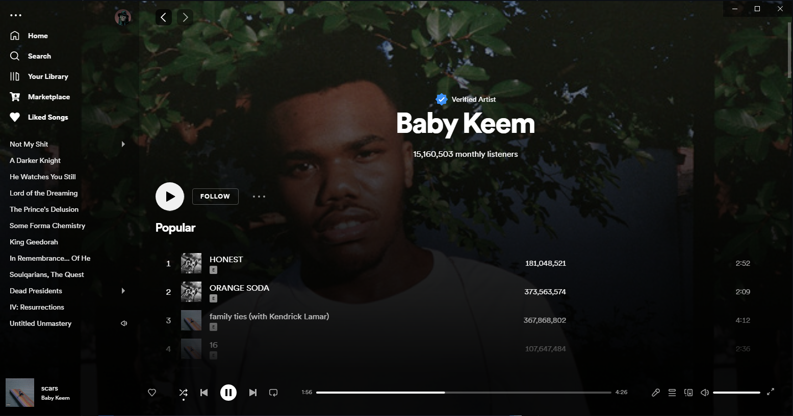
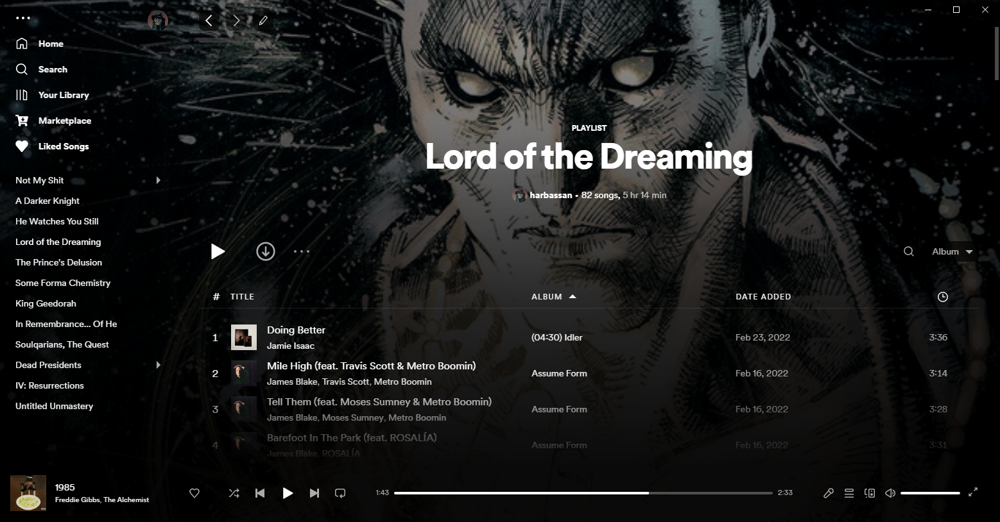
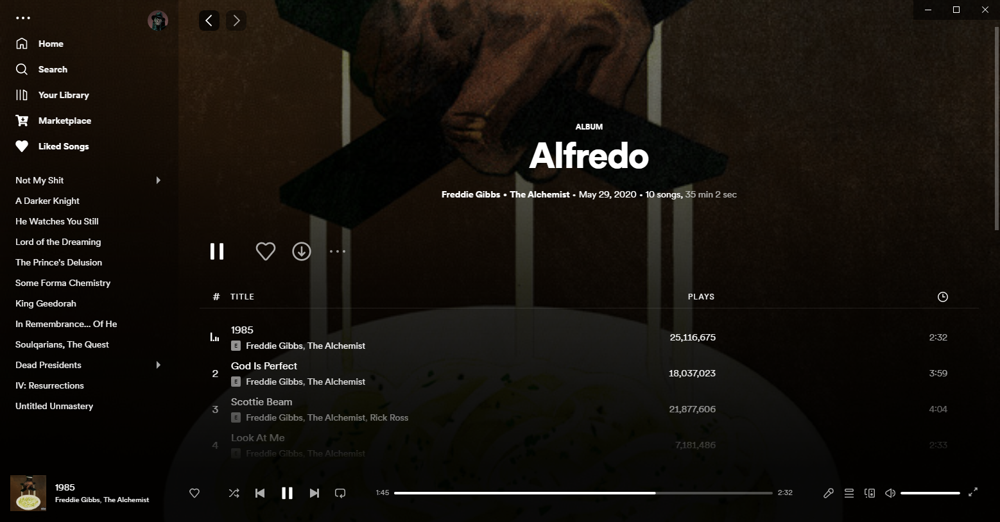

# Spicetify Galaxy

### Uses fullscreen images to greatly improve your Spotify experience. Add your own images to playlists and the home page.

---





---

### Customisation

To change the home background image and playlist background images click the edit button which shows up on the top left of the page. This will open a menu where you can input the image, either by entering the url (the recommended option) or choosing a locally downloaded image. There is also an option on the home page to use the currently playing song as the background.

Note that if you select locally downloaded images for the backgrounds, there will be a limited space. Therefore using urls is much better, and a good way to do this is by hosting the images on a cloud storage service and then inputing the urls.

If there is no custom image set for a playlist it will default to the cover image.

Go into your theme folder and open either:

`color.ini` to modify the colors

`user.css` to modify the style code

---

### Manual Installation

After cloning the repo add the files `user.css` and `color.ini` into a new folder named `Galaxy`, and place this folder into your `Themes` folder in `.spicetify`.

Then run these commands to apply:

```powershell
spicetify config current_theme Galaxy
spicetify config inject_css 1 replace_colors 1 overwrite_assets 1
spicetify apply
```

To enable the extension (which is a necessary step), add the file `extension.js` into the `Extensions` folder in `.spicetify`.

Then run the commands:

```powershell
spicetify config extensions galaxy.js
spicetify apply
```

---

If you have any questions or issues regarding the theme open an issue on this repo. Please specify your spicetify version and installation method if you do so.
