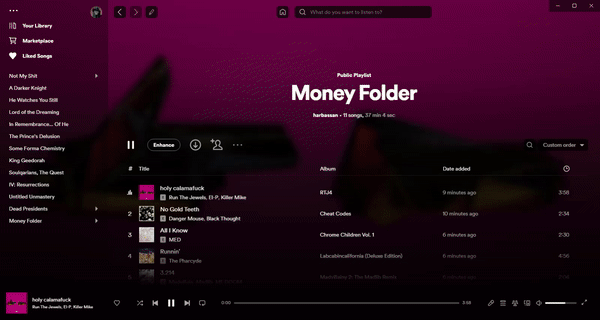

# Spicetify Galaxy

### A fully dynamic and customisable theme that uses fullscreen images to greatly improve your Spotify experience.

---

### Dynamic Album Art



---

### Custom Backgrounds <span style="font-size: 0.5em">(per playlist or app wide)</span>


---

### Fullscreen Artist/Album Backgrounds


---

### Fully Customisable


#### How to Customise

To change the home background image or playlist background images click the edit button which shows up on the top left of the page. This will open a menu where you can input the image, either by entering the url (the recommended option) or choosing a locally downloaded image. If there is no custom image set for a playlist it will default to the playlist cover image.
Note that if you select locally downloaded images for the backgrounds, there will be a limited space. Therefore using urls is much better.

There are multiple options in the home page settings (top left corner) which provide further customisations. These include:

-   adding blur (two seperate options for home vs other pages)
-   use of the currently playing song as page backgrounds
-   use of a single image across all of the app
-   adding/removing the album/playlist header image

##### How to edit the source

Go into your theme folder and open either:

`color.ini` to modify the colors

`user.css` to modify the style code

---

### Manual Installation

After cloning the repo add the files `user.css`, `color.ini` and `theme.js` into a new folder named `Galaxy`, and place this folder into your `Themes` folder in `%localappdata%\spicetify`.

Then run these commands to apply:

```powershell
spicetify config current_theme Galaxy
spicetify config inject_css 1 replace_colors 1 overwrite_assets 1
spicetify apply
```

To enable the extension (which is a necessary step), add the file `extension.js` into the `Extensions` folder in `%localappdata%\spicetify`.

Then run the commands:

```powershell
spicetify config extensions galaxy.js
spicetify apply
```

---

If you have any questions or issues regarding the theme open an issue on this repo. Please specify your spicetify version and installation method if you do so.

If you really like the theme i'd be grateful if you liked the repo ❤️.
